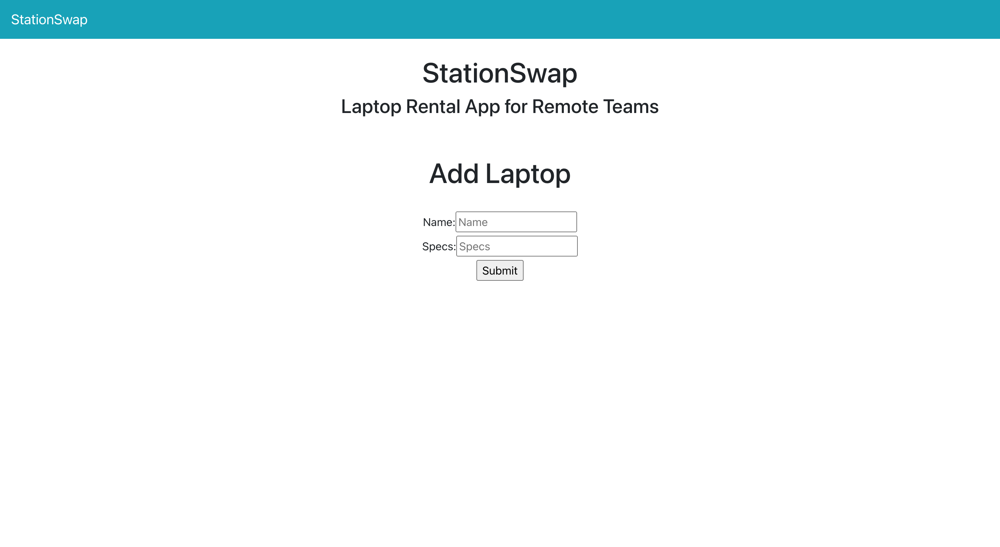

# StationSwap

StationSwap is a laptop rental app that allows you to add new laptops and new laptop rentals. This project was setup by created a new Rails API on the backend and serving data up to a React-Redux frontend. 



### Getting Started

Here is a step-by-step guide to get the project started. 

clone the project:
```
$ git clone 'git@github.com:TerryThreatt/stationswap.git'
```

navigate to the backend: 

```
$ cd backend
```

load project dependencies: 

```
$ bundle install 
```

create database: 

```
$ rake db:create
```

migrate tables: 

```
$ rake db:migrate
```

start with some laptop seed data: 

```
$ rake db:seed 
```

start up a server: 

```
$ rails s
```

get started with the frontend: 

```
$ yarn start 
```


## Built With

* [Rails](https://rubyonrails.org/) - The web framework used
* [PostgreSQL](https://www.postgresql.org/) - Database management system with ActiveRecord 
* [Active Record Serializers](https://github.com/rails-api/active_model_serializers) - Data serializer with ActiveRecord 
* [Materialize CSS](https://materializecss.com/) - Frontend CSS framework 

## Versioning

This is V1 for the laptop rentals rails api. 


## License

This project is licensed under the MIT License - see the [LICENSE](LICENSE) file for details
