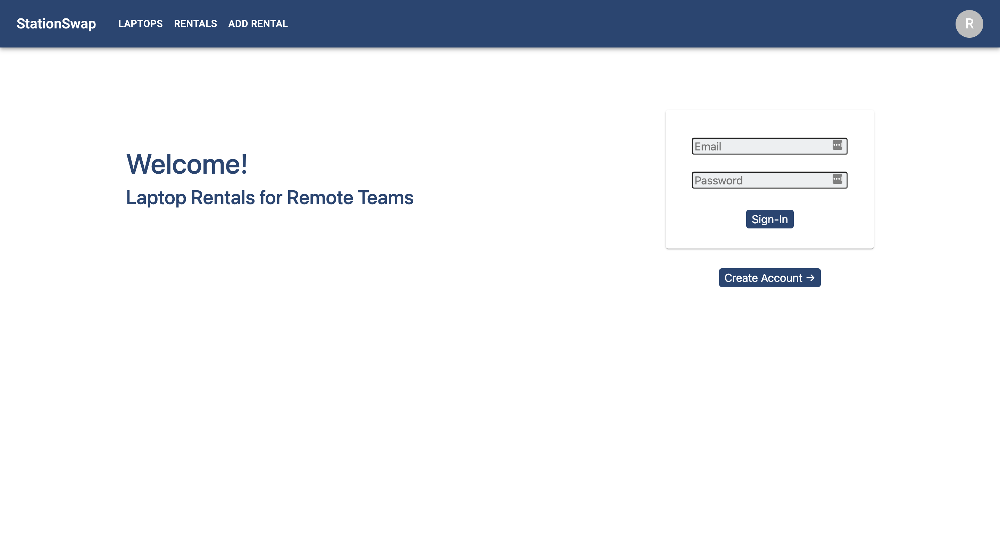

# StationSwap

StationSwap is a laptop rental app that allows you to add new laptops and new laptop rentals. This project was setup by created a new Rails API on the backend and serving data up to a React-Redux frontend.

[Live App](https://ecstatic-pasteur-c04207.netlify.app/)



### Getting Started

Here is a step-by-step guide to get the project started.

clone the project:

```
$ git clone 'git@github.com:TerryThreatt/stationswap.git'
```

get started with the frontend:

```
$ yarn start
```

## Built With

- [React](https://reactjs.org/) - Javascript Library
- [Redux](https://redux.js.org/) - Predictable State Container
- [Redux-Thunk](https://github.com/reduxjs/redux-thunk) - Asynchronous Redux middleware
- [React-Router](https://reactrouter.com/) - Client-Side Routing Library
- [Rails](https://rubyonrails.org/) - The backend framework used
- [PostgreSQL](https://www.postgresql.org/) - Database management system with ActiveRecord
- [Active Record Serializers](https://github.com/rails-api/active_model_serializers) - Data serializer with ActiveRecord
- [Boostrap](https://getbootstrap.com/) - Frontend CSS Library

## Versioning

This is V1 for the laptop rentals rails api.

## License

This project is licensed under the MIT License - see the [LICENSE](LICENSE) file for details
